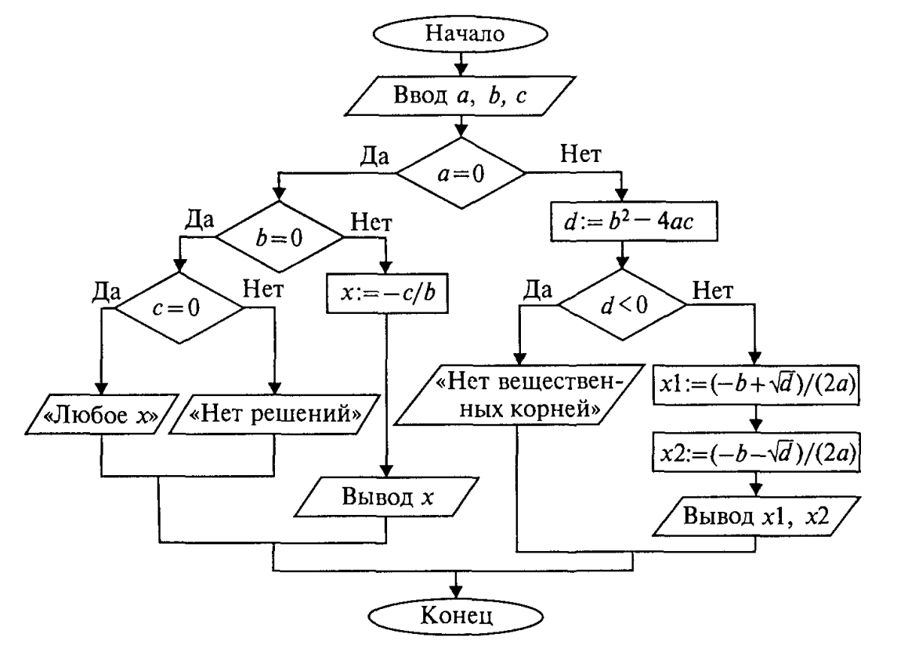
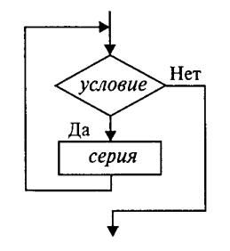
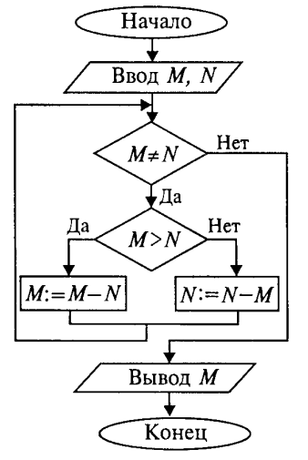
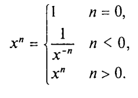

# Основные алгоритмические конструкции
Алгоритм применительно к вычислительной машине — точное предписание, т.е. набор операций н правил их чередования, при помощи которого, начиная с некоторых исходных данных, можно решить любую задачу фиксированного типа.

Алгоритмы в зависимости от цели, начальных условий задачи, путей ее решения, определения действий исполнителя подразделяются следующим образом:

**Линейный алгоритм** — набор команд (указаний), выполняемых последовательно друг за другом.

Основным элементарным действием в линейных алгоритмах является присваивание значения переменной величине. Если значение константы определено видом ее записи, то переменная величина получает конкретное значение только в результате присваивания. Присваивание может осуществляться двумя способами: с помощью команды присваивания и с помощью команды ввода.

Рассмотрим пример. В школьном учебнике математики правила деления обыкновенных дробей описаны так:
1. Числитель первой дроби умножить на знаменатель второй дроби.
2. Знаменатель первой дроби умножить на числитель второй дроби.
3. Записать дробь, числитель которой есть результат выполнения пункта 1, а знаменатель — результат выполнения пункта 2.

В алгебраической форме это выглядит следующим образом:


Построим алгоритм деления дробей для ЭВМ. В этом алгоритме сохраним те же обозначения для переменных, которые использованы в записанной выше формуле. Исходными данными являются целочисленные переменные а, Ь, с, d. Результатом — также целые величины m и n. Блок-схема и текст алгоритма на языке Pascal приведены ниже.


```
program div_drobi
var
  a,b,c,d,m,n: integer;
begin
  read(a,b,c,d);
  m := a*d;
  n := b*c;
  writeln(m, n);
end;
```

Формат команды присваивания следующий:  
```
переменная := выражение  
```    
Знак «:=» нужно читать как «присвоить».  

Команда присваивания обозначает следующие действия, выполняемые компьютером:
1. Вычисляется выражение.
2. Полученное значение присваивается переменной.

В приведенном выше алгоритме присутствуют две команды присваивания. В блок-схемах команда присваивания записывается в прямоугольнике. Такой блок называется вычислительным блоком.

В описаниях алгоритмов необязательно соблюдать строгие правила в записи выражений. Их можно писать в обычной математической форме. Это еще не язык программирования со строгим
синтаксисом.

В приведенном алгоритме присутствует команда ввода:
```
read(a,b,c,d);
```
В блок-схеме команда ввода записывается в параллелограмме — блоке ввода-вывода. При выполнении данной команды процессор прерывает работу и ожидает действий пользователя. Пользователь должен набрать на устройстве ввода (клавиатуре) значения вводимых переменных и нажать на клавишу ввода Enter. Значения следует вводить в том же порядке, в каком соответствующие переменные расположены в списке ввода. Обычно с помощью команды ввода присваиваются значения исходных данных, а команда присваивания используется для получения промежуточных и конечных величин.

Полученные компьютером результаты решения задачи должны быть сообщены пользователю. Для этих целей предназначена команда вывода:
```
writeln(m,n);
```
С помощью этой команды результаты выводятся на экран или на устройство печати на бумагу.

Поскольку присваивание является важнейшей операцией в вычислительных алгоритмах, обсудим ее более подробно.

Рассмотрим последовательное выполнение четырех команд присваивания, в которых участвуют две переменные величины a и b.

В приведенной ниже таблице напротив каждой команды присваивания указываются значения переменных, которые устанавливаются после ее выполнения.

Команда | a | b
--------|---|---
a:=1    | 1 | -
b:=a*2  | 1 | 2
a:=b    | 2 | 2
b:=a+b  | 2 | 4


Этот пример иллюстрирует три основных свойства команды присваивания:
* пока переменной не присвоено значение, она остается неопределенной;
* значение, присвоенное переменной, сохраняется в ней вплоть до выполнения следующей команды присваивания этой переменной;
* новое значение, присваиваемое переменной, заменяет ее предыдущее значение.

Рассмотрим один очень полезный алгоритм, который приходится часто использовать при программировании. Даны две величины: Х и Y. Требуется произвести между ними обмен значениями. Например, если первоначально было Х=1, Y=2, то после обмена должно стать: Х=2, У=1.

Хорошей моделью для решения этой задачи является следующая ситуация: имеются два стакана — один с молоком, другой с водой. Требуется произвести обмен их содержимым. Всякому ясно,
что в этом случае нужен дополнительный третий пустой стакан. Последовательность действий будет следующей: 1) перелить из первого стакана в третий; 2) перелить из второго в первый;
3) перелить из третьего во второй. Цель достигнута!

По аналогии для обмена значениями двух переменных нужна третья дополнительная переменная. Назовем ее Z. Тогда задача обмена решается последовательным выполнением трех команд присваивания:

Команда   | X | Y | Z
----------|---|---|---
ввод X, Y | 1 | 2 | -
Z := X    | 1 | 2 | 1
X := Y    | 2 | 2 | 1
Y := Z    | 2 | 1 | 1

Аналогия со стаканами не совсем точна в том смысле, что при переливании из одного стакана в другой первый становится пустым. В результате же присваивания (Х := Y) переменная, стоящая
справа (У), сохраняет свое значение.

Алгоритм для деления дробей имеет линейную структуру. В нем все команды выполняются в строго однозначной последовательности, каждая по одному разу. Линейный алгоритм составляется
из команд присваивания, ввода, вывода и обращения к вспомогательным алгоритмам (об этом позже).

При описании алгоритмов в блок-схемах типы, как правило, не указываются (но подразумеваются). В алгоритмах для всех переменных типы указываются явно. Описание типов переменных
производится сразу после заголовка алгоритма. В них используются следующие обозначения типов: integer — целый тип, real — вещественный тип, string — символьный (литерный) тип, boolean — логический тип. В алгоритме для деления дробей для всех переменных
указан тип integer.

**Разветвляющийся** алгоритм — алгоритм, содержащий хотя бы одно условие, в результате проверки которого ЭВМ обеспечивает переход на один из двух возможных шагов.

**Циклический алгоритм** — алгоритм, предусматривающий многократное повторение одного и того же действия (одних и тех же операций) над новыми исходными данными. К циклическим алгоритмам сводится большинство методов вычислений, перебора вариантов. Цикл программы — последовательность команд (серия, тело цикла), которая может выполняться многократно (для новых исходных данных) до удовлетворения некоторому условию.

Составим алгоритм решения квадратного уравнения
```
ax^2+bx+c=0
```
Задача хорошо знакома из математики. Исходными данными здесь являются коэффициенты а, b, с. Решением в общем случае будут два корня х1 и х2, которые вычисляются по формуле:


Все используемые в этой программе величины вещественного типа. 

```
program korni_kvadratnogo_uravneniya;
var
  a, b, c, x1, x2, d: real;
begin
  read(a, b, c);
  d:=sqr(b)-4*a*c;
  x1:=(-b+sqrt(d))/(2*a);
  x2:=(-b=sqrt(d))/(2*a);
end;   
```

Слабость такого алгоритма видна невооруженным глазом. Он не обладает важнейшим свойством, предъявляемым к качественным алгоритмам, — универсальностью по отношению к исходным данным. *Какими бы ни были значения исходных данных, алгоритм должен приводить к определенному результату и завершать работу.* Результатом может быть число, но может быть и сообщение о
том, что при определенных данных задача решения не имеет. Недопустимы остановки в середине алгоритма из-за невозможности выполнить какую-то операцию. Упомянутое свойство называют результативностью алгоритма (в любом случае должен быть получен какой-то результат). 

Чтобы построить универсальный алгоритм, сначала требуется тщательно проанализировать математическое содержание задачи. 

Решение уравнения зависит от значений коэффициентов а, b, с. Вот анализ рассмотренной выше задачи (ограничиваемся только поиском вещественных корней):
если а = 0, b = 0, с = 0, то любое х — решение уравнения;  
если а = 0, b = 0, с <> О, то уравнение действительных решений не имеет;  
если а = 0, b <> О, то это линейное уравнение, которое имеет одно решение х = -c/b;  
если а<>0 и d=b^2-4ac >= 0, то уравнение имеет два вещественных корня (формулы приведены выше);  
если a<>0 и d<0, то уравнение не имеет вещественных корней.



Этот же алгоритм на ЯП: 
```
procedure korni_kvadratnogo_uravnenia;
var
  a, b, c, d, x1, x2: real;
begin
  read(a, b, c);
  if a=0 then begin
    if b=0 then begin
      if c=0 then writeln('любое X')
      else writeln('нет решений');
    end
    else begin
      x1:=-c/b;
      writeln(x1);
    end;
  end
  else begin
    d:=sqr(b)-4*a*c;
    if d<0 then writeln('нет вещественных корней')
    else begin
      x1:=(-b+sqrt(d))/(2*a);
      x2:=(-b-sqrt(d))/(2*a);
      writeln(x1, x2);
    end;
  end;
end.  
```

В этом алгоритме многократно использована *структурная команда ветвления*. Общий вид команды ветвления в блок-схемах и на ЯП следующий: 


```
if условие then серия1
else серия2 
```

Вначале проверяется условие (вычисляется отношение, логическое выражение). Если условие истинно, то выполняется серия 1 — последовательность команд, на которую указывает стрелка с надписью «да» (положительная ветвь). В противном случае выполняется серия 2 (отрицательная ветвь). В ЯП условие записывается после служебного слова if, положительная ветвь — после слова then, отрицательная — после слова else.

Если на ветвях одного ветвления содержатся другие ветвления, то такой алгоритм имеет структуру *вложенных ветвлений*. Именно такую структуру имеет алгоритм «Корни квадратного уравнения».

Рассмотрим следующую задачу: дано целое положительное число n. Требуется вычислить n! (n-факториал). Вспомним определение факториала: 


Ниже приведена блок-схема алгоритма. В нем используются три переменные целого типа: n — аргумент; i — промежуточная переменная; F — результат. Для проверки правильности алгоритма построена трассировочная таблица. В такой таблице для конкретных значений исходных данных по шагам прослеживается изменение переменных, входящих в алгоритм. Данная таблица составлена для случая п = 3. 


Шаг | n |  F  | i | Условие
:--:|:-:|:---:|:-:|---------
1   | 3 |     |   | 
2   |   | 1   |   |    
3   |   |     | 1 |    
4   |   |     |   | 1<=3, да    
5   |   | 1   |   |    
6   |   |     | 2 |    
7   |   |     |   | 2<=3, да
8   |   | 2   |   |    
9   |   |     | 3 | 
10  |   |     |   | 3<=3, да
11  |   | 6   |   |    
12  |   |     | 4 |    
13  |   |     |   | 4<=3, нет
14  |   |вывод|   |    

Трассировка доказывает правильность алгоритма. Теперь запишем этот алгоритм на ЯП. 
```
program faktorial;
var
  n, i, F: integer;
begin
  read(n);
  F:=1; i:=1;
  while i<=n do begin
    F := F*i;
    i := i+1;
  end;
  writeln(F);
end;  
```

Этот алгоритм имеет циклическую структуру. В алгоритме использована структурная команда цикл-пока, или цикл с предусловием. Общий вид команды цикл-пока в блок-схемах и в ЯП следующий: 



```
while условие do begin
  серия
end;
```

Выполнение серии команд (тела цикла) повторяется, пока условие цикла истинно. Когда условие становится ложным, цикл заканчивает выполнение.

Цикл с предусловием — это основная, но не единственная форма организации циклических алгоритмов. Другим вариантом является цикл с постусловием. Вернемся к алгоритму решения
квадратного уравнения. К нему можно подойти с такой позиции:  

если а = 0, то это уже не квадратное уравнение и его можно не рассматривать. В таком случае будем считать, что пользователь ошибся при вводе данных, и следует предложить ему повторить
ввод. Иначе говоря, в алгоритме будет предусмотрен контроль достоверности исходных данных с предоставлением пользователю возможности исправить ошибку. Наличие такого контроля — еще
один признак хорошего качества программы. 


```
program kvadratnoe_uravnenie;
var
  a, b, c, d, x1, x2: real;
begin
  repeat
    read(a, b, c);
  until a<>0;
  d:=sqr(b)-4*a*c;
  if d>=0 then begin
    x1 := (-b+sqrt(d))/(2*a);  
    x2 := (-b-sqrt(d))/(2*a);  
    writeln(x1, x2);
  end
  else
    writeln('нет вещественных корней');
end.  
```
В общем виде структурная команда цикл с постусловием или цикл — до представляется так: 


```
repeat
  серия
until условие
```

Здесь используется условие окончания цикла. Когда оно становится истинным, цикл заканчивает работу. 

Составим алгоритм решения следующей задачи: даны два натуральных числа М и N. Требуется вычислить их наибольший общий делитель — НОД(M, N). 

Эта задача решается с помощью метода, известного под названием алгоритма Евклида. Его идея основана на том свойстве, что если M>N, то НОД(М, N) = НОД(М-N,N). Другой факт, лежащий в основе алгоритма, тривиален — НОД(М, М) = М. Для «ручного» выполнения этот алгоритм можно описать в форме следующей инструкции: 

1. Если числа равны, то взять их общее значение в качестве ответа; в противном случае продолжить выполнение алгоритма
2. Определить большее из чисел
3. Заменить большее число разностью большего и меньшего значений
4. Вернуться к выполнению пункта 1



```
program evklid;
var
  m, n: integer;
begin
  read(m,n);
  while m<>n do begin
    if m>n then m:=m-n
    else n:=n-m;
  end;
  writeln(m);
end;
```
Алгоритм имеет структуру цикла с вложенным ветвлением. Проделайте самостоятельно трассировку этого алгоритма для случая М = 18, N = 12. В результате получится НОД = 6, что,
очевидно, верно. 

## Вспомогательные алгоритмы и процедуры
В теории алгоритмов известно понятие вспомогательного алгоритма. Вспомогательным называется алгоритм решения некоторой подзадачи из основной решаемой задачи. В таком случае алгоритм решения исходной задачи называется основным алгоритмом.

В качестве примера рассмотрим следующую задачу: требуется составить алгоритм вычисления степенной функции с целым показателем у = х^к, где к — целое число, х<>0. В алгебре такая функция определена следующим образом: 



Для данной задачи в качестве подзадачи можно рассматривать возведение числа в целую положительную степень.

Учитывая, что 1/х^-n = (1/х)^-n, запишем основной алгоритм решения этой задачи. 

```
program stepennaya_funkciya;
var
  n: integer;
  x, y: real;
begin
  read(x, n);
  if n=0 then y := 1
  else begin
    if n>0 then stepen(x, n, y)
    else stepen(1/x, -n, y);
  end;
  writeln(y);
end;
```

Здесь дважды присутствует команда обращения к вспомогательному алгоритму с именем **stepen**. Это алгоритм возведения вещественного основания в целую положительную степень путем его многократного перемножения. Величины, стоящие в скобках в команде обращения к вспомогательному алгоритму, называются фактическими параметрами.

В ЯП вспомогательные алгоритмы оформляются в виде процедур. Запишем процедуру stepen.

```
procedure stepen(a: real; k: integer; var z: real);
var
  i: integer;
begin
  z:=1; i:=1;
  while i<=k do begin
    z:=z*a;
    i:=i+1;
  end;
end;  
```
Заголовок вспомогательного алгоритма начинается с ключевого слова «procedure», после которого следует имя процедуры и в скобках — список формальных параметров. В этом списке перечисляются переменные-аргументы и переменные-результаты с указанием их типов. Здесь а и к — формальные параметры-аргументы, z — параметр-результат. Следовательно, процедура stepen производит вычисления по формуле z=а^к. В основном алгоритме «Степенная функция» обращение к процедуре производится путем указания ее имени с последующим в скобках списком фактических параметров. Между формальными и фактическими параметрами процедуры должны выполняться следующие правила соответствия: 

* по количеству (сколько формальных, столько и фактических параметров)
* по последовательности (первому формальному соответствует первый фактический параметр, второму — второй и т.д.)
* по типам (типы соответствующих формальных и фактических параметров должны совпадать)

Фактические параметры-аргументы могут быть выражениями соответствующего типа.

Обращение к процедуре инициирует следующие действия:
1. Значения параметров-аргументов присваиваются соответствующим формальным параметрам.
2. Выполняется тело процедуры (команды внутри процедуры).
3. Значение результата передается соответствующему фактическому параметру, и происходит переход к выполнению следующей команды основного алгоритма.

В процедуре stepen нет команд ввода исходных данных и вывода результатов. Здесь присваивание начальных значений аргументам (а, k) производится через передачу параметров-аргументов. А присваивание результата переменной (у) происходит через
передачу параметра-результата (z). Таким образом, передача значений параметров процедур — это третий способ присваивания (наряду с командой присваивания и командой ввода).

Использование процедур позволяет строить сложные алгоритмы методом *последовательной детализации*.

***
**Вероятностный** (стохастический) алгоритм дает программу решения задачи несколькими путями или способами, приводящими к вероятному достижению результата.

**Эвристический** алгоритм (от греческого слова «эврика») — это такой алгоритм, в котором достижение конечного результата программы действий однозначно не предопределено, так же как не обозначена вся последовательность действий, не выявлены все действия исполнителя. К эвристическим алгоритмам относят, например, инструкции и предписания. В этих алгоритмах используются универсальные логические процедуры и способы принятия решений, основанные на аналогиях, ассоциациях и прошлом опыте решения схожих задач.
***

# Программы для графического отображения алгоритмов
https://draw.io (онлайн)  
Microsoft Visio  
Dia (бесплатная) 
