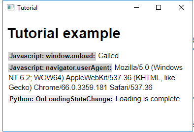

[содержание](/readme.md)  

# Тема 8.<br/>Лекция 2 Создание оконного приложения на базе Cromium Embedded Framework.

С помощью CEFPython мы можем создавать приложения, движком у которых будет Cromium Embedded Framework, т.е. по сути это web-страничка, дизайн для которой может накидать каждый второй.

## Установка
Тут все просто, выполняем команду:
```
pip install cefpython3==66.0
```

## Пишем приложение
Я буду писать по этой [инструкции](https://github.com/cztomczak/cefpython/blob/master/docs/Tutorial.md). Тестовое приложение сразу запустилось, осталось разобраться что там и как работает.

```py
from cefpython3 import cefpython as cef
import base64
import platform
import sys

HTML_code = """
<!DOCTYPE html>
<html>
<head>
    <script>
    function js_print(lang, event, msg) {
        msg = "<b class="+lang+">"+lang+": "+event+":</b> " + msg;
        console = document.getElementById("console")
        console.innerHTML += "<div class=msg>"+msg+"</div>";
    }
    window.onload = function(){
        js_print("Javascript", "window.onload", "Called");
        js_print("Javascript", "navigator.userAgent", navigator.userAgent);
    };
    </script>
</head>
<body>
    <h1>Tutorial example</h1>
    <!--сюда будет складыват сообщения js_print-->
    <div id="console"></div>
</body>
</html>
"""

def main():
    # проверка версии CEF
    check_versions()
    # перегружает питоновский обработчик исключений
    sys.excepthook = cef.ExceptHook  
    # инициализация CEF - должна быть вызвана до создания окон
    cef.Initialize()
    # создание браузера
    browser = cef.CreateBrowserSync(url=html_to_data_uri(HTML_code),
                          window_title="Tutorial")
    # запуск очереди сообщений
    cef.MessageLoop()
    # завершение работы - должна быть запущена для очистки "хвостов"
    cef.Shutdown()

def check_versions():
    ver = cef.GetVersion()
    print("[tutorial.py] CEF Python {ver}".format(ver=ver["version"]))
    print("[tutorial.py] Chromium {ver}".format(ver=ver["chrome_version"]))
    print("[tutorial.py] CEF {ver}".format(ver=ver["cef_version"]))
    print("[tutorial.py] Python {ver} {arch}".format(
           ver=platform.python_version(),
           arch=platform.architecture()[0]))
    assert cef.__version__ >= "57.0", "CEF Python v57.0+ required to run this"

if __name__ == '__main__':
    main()
```

Кроме создания окна браузера приложение еще выведет в консоль справочную информацию о версии CEF и Python, что-то типа такого:

```
[tutorial.py] CEF Python 66.0
[tutorial.py] Chromium 66.0.3359.181
[tutorial.py] CEF 3.3359.1774.gd49d25f
[tutorial.py] Python 3.7.2 32bit
```

Для получения событий браузера можно задать Client handlers, по сути это функции обратного вызова, которые будут запущены при возникновении нужного нам события в браузере. Добавим LoadHandler() и DisplayHandler()

```py
    browser = cef.CreateBrowserSync(url=html_to_data_uri(HTML_code),
                                    window_title="Tutorial")
    # добавляем функцию устанавливающие наши функции
    set_client_handlers(browser)

def set_client_handlers(browser):
    client_handlers = [LoadHandler(), DisplayHandler()]
    for handler in client_handlers:
        browser.SetClientHandler(handler)

def js_print(browser, lang, event, msg):
    # выполняет В БРАУЗЕРЕ Javascript-функцию "js_print"
    browser.ExecuteFunction("js_print", lang, event, msg)

class LoadHandler(object):
    def OnLoadingStateChange(self, browser, is_loading, **_):
        """Будет вызвана при изменении состояния загрузки"""
        if not is_loading:
            # Loading is complete. DOM is ready.
            js_print(browser, "Python", "OnLoadingStateChange",
                     "Loading is complete")

class DisplayHandler(object):
    def OnConsoleMessage(self, browser, message, **_):
        """А эта функция будет вызвана при появлении сообщений в консоли браузера (обычно это ошибки, но можно через это событие настроить обмен данными)"""
        # This will intercept js errors, see comments in OnAfterCreated
        if "error" in message.lower() or "uncaught" in message.lower():
            # Prevent infinite recurrence in case something went wrong
            if "js_print is not defined" in message.lower():
                if hasattr(self, "js_print_is_not_defined"):
                    print("Python: OnConsoleMessage: "
                          "Intercepted Javascript error: "+message)
                    return
                else:
                    self.js_print_is_not_defined = True
            # Delay print by 0.5 sec, because js_print may not be
            # available yet due to DOM not ready.
            args = [browser, "Python", "OnConsoleMessage",
                    "(Delayed) Intercepted Javascript error: <i>{error}</i>"
                    .format(error=message)]
            threading.Timer(0.5, js_print, args).start()
```



В окне в последней строке видим что сработала наша callabck-функция.

## Интеграция jaascript
Код программы выполняется в основном процессе (процесс браузера), а javascript запущен в процессе рендеринга. Взаимодействие между основной программой (Питон) и Javascript можно организовать асинхронными межпроцессными сообщениями или http-запросами (как синхронными так и асинхронными)

### Асинхронные сообщения
Для организации межпроцессного обмена необходимо:
* использовать класс JavascriptBindings 