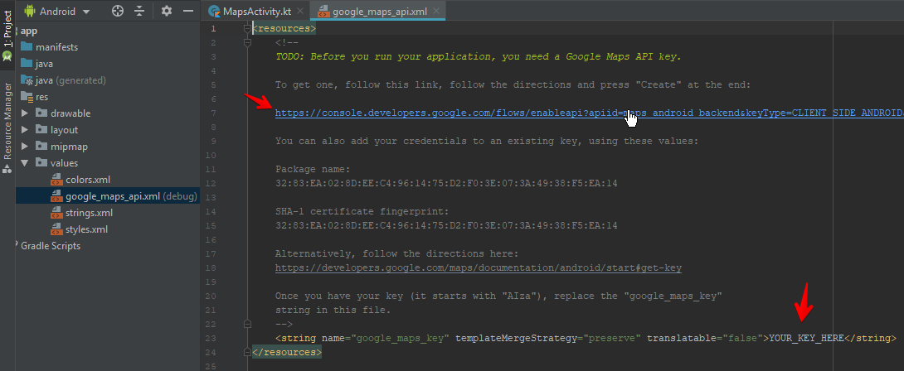
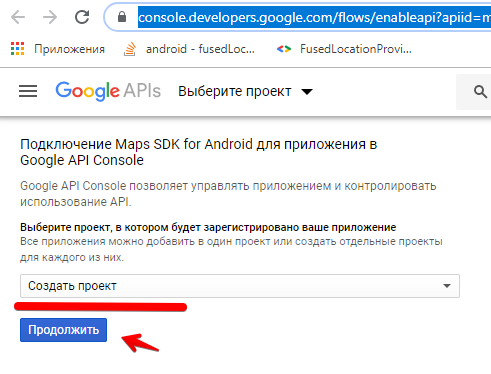

Проект **Достопримечательности**

Цели:

* Работа с сетью (GET, POST запросы, авторизация, получение данных)
* Научитсья работать с Google Maps (вывод текущей позиции и создание маркеров достопримечательностей)
* Научиться работать с *Custom View* - изображение достопримечательности с детальным описанием вместо текстовой метки
* Построение маршрутов (по выбранным маркерам)

Структура приложения:

* **Первый экран**: заставка (в фоне авторизация на сервере и запрос геолокации). При успешной авторизации переходим на второй экран (с картой)

* **Второй экран**: карта. 
    * При переходе на экран с сервера запрашивается список достопримечательностей
    * список достопримечательностей и текущая локация отображаются на карте
    * по клику на достопримечательности показывать *Custom View* и помечать (или отменять отметку) для последующего запроса построения маршрута
    * при выборе достопримечательностей показывать/скрывать кнопку *Построить маршрут*
    * при клике на эту кнопку отправлять запрос на построение маршрута

## Авторизация на сервере

> Для сетевых запросов далее будем пользоваться библиотекой [Fuel](https://github.com/kittinunf/fuel). 

### Установка библиотеки

В зависимости приложения добавляем ``implementation 'com.github.kittinunf.fuel:fuel-android:2.2.1'`` (актуальную версию библиотеки уточняйте на сайте разработчика)

> не забываем в манифесте разрешить работу с интерентом: ``<uses-permission android:name="android.permission.INTERNET"/>``

В импорт добавить ``import com.github.kittinunf.result.Result`` (автоматически он не цепляется)

### Примеры запросов

Запросы бывают двух типов: синхронные (приложение ждет ответа от сервера, останавливая работу - такие запросы имеет смысл использовать только при авторизации, когда дальше просто нельзя двигаться) и асинхронные (запрос посылается в фоне, выполнение программы продолжается - такой режим предпочтительнее, т.к. не "замораживает" интерфейс). 

В последних версиях Андроид синхронные запросы в основном потоке запрещены, так что рассматривать будем только асинхронные

> Вариантов авторизации существует множество, далее рассмотрен вариант, который использовался в демо-экзамене на курсах "Мастера 5000"

Алгоритм авторизации:

* при любом запросе (кроме login и logout) должен добавляться параметр **token**
* если токен не найден, то вернется сообщение, что пользователь не авторизован: ``{"notice":{"answer": "user not authorized"}}``
* для получения токена необходимо послать **post** запрос на URL ``/login`` с параметрами login и password (в качестве логина используйте ИФамилия в латинской транскрипции, т.е. Евгений Колесников = EKolesnikov. Пароль любой)
* если токен уже был получен, то сервер вернет ошибку ``{"notice":{"answer": "User is active"}}``, в этом случае нужно разлогиниться (послать запрос с теми же параметрами на URL ``/logout``). При успешной авторизации сервер вернет токен: ``{"notice": {"token":123}``

> Адрес сервера динамический, уточняйте в начале лабораторной/практики

```kt
Fuel
    .post(  "http://192.168.1.154:8080/login", 
            listOf("login" to "ekolesnikov", "password" to "passw"))
    .responseString { request, response, result ->
        when (result) {
            is Result.Failure -> {
                // отображает сообщение на экране
                Toast.makeText(applicationContext,
                                result.getException().toString(),
                                Toast.LENGTH_LONG).show()
            }
            is Result.Success -> {
                // тут реализуете разбор полученного ответа
            }
        }
    }
```

В параметрах метода **.post** передаются *URL* сервера и список параметров (логин и пароль). Метод **.responseString** срабатывает при получении ответа от сервера.

> Приложение может не запуститься, выдав ошибку "Cleartext HTTP traffic to ... not permitted" - в последних версиях Андроида по-умолчанию запрещено работать без ssl. Для разрешения открытого траффика добавьте в манифест в секцию **application** аттрибут ``android:usesCleartextTraffic="true"``

**Критерии оценки:**

* реализован метод *login* - 1 балл;
* реализован метод *logout* - 1 балл;
* выводится сообщение об ошибке связи/авторизации - 1 балл;
* автоматический вызов метода *logout* при ошибке "User is active" - 1 балл.

## Создание приложения с Google Maps

1. Добавляем в приложение новое Activity, выбрав форму "Google Maps Activity"

После создания Activity Android Studio автоматически создаст и откроет файл ``google_maps_api.xml`` для генерации ключа.

1. Перейдите по ссылке



2. Создайте новый проект



3. Создайте ключ API

4. Полученный ключ вставьте в google_maps_api.xml (файл из которого переходили по ссылке)

И немного поправим стандартный метод **onMapReady**

```kt
override fun onMapReady(googleMap: GoogleMap) {
    mMap = googleMap

    // координаты техникума
    val yotc = LatLng(56.639439, 47.892384)

    // к метке добавлена подпись
    mMap.addMarker(MarkerOptions().position(yotc).title("Метка ЙОТК")
        .snippet("Йошкар-Олинский Технологический Коледж"))

    // используем камеру с масштабированием
    mMap.moveCamera(CameraUpdateFactory.newLatLngZoom(yotc, 16F))
}
```

**Критерии оценки:**

* на экране выводится участок карты с техникумом - 1 балл.

### Добавление текущей позиции

1. Для получения текущей позиции в build.graddle (app) добавляем зависимость ``implementation 'com.google.android.gms:play-services-location:17.0.0'``

2. Для хранения текущих координат добавляем приватные аттрибуты класса:

```kt
    private var lat: Double = 0.0
    private var lon: Double = 0.0
```

3. В конструкторе инициализируем локатор (зависимости для локатора см. в проекте **Погода**):

```kt
Locus.getCurrentLocation(this) { result ->
    result.location?.let {
        lat = it.latitude
        lon = it.longitude

        // тут можно вызвать функцию отображения текущей геолокации

    } ?: run {
        val msg = "${error}${result.error?.message}"
        Toast.makeText(applicationContext,
            msg,
            Toast.LENGTH_LONG).show()
    }
}
```

Включение слоя с текущей геолокацией:

```kt
// на карте включаем слой с текущей локацией
mMap.isMyLocationEnabled = true

// и переносим камеру на текущую локацию
currentLatLng = LatLng(lat, lon)
mMap.animateCamera(CameraUpdateFactory.newLatLngZoom(currentLatLng, 14f))
```

4. В методе ``onMapReady`` запрашиваем список достопримечательностей (можно и в конструкторе, но пока карты нет - нет смысла в этих данных)

```kt
Fuel.post("http://192.168.1.154:8080/points",
    listOf("token" to token))
    .responseString{request, response, result ->

        // тут разбираем ответ сервера

    }
```

В этом же методе можно прикрутить **слушателя** на событие клика по маркерам (по клику мы меняем цвет маркера и показываем/скрываем кнопку расчета маршрута):

```kt
mMap.setOnMarkerClickListener(object : GoogleMap.OnMarkerClickListener {
    override fun onMarkerClick(marker: Marker): Boolean {
        if(marker.tag==0) {
            marker.tag = 1
            marker.setIcon(BitmapDescriptorFactory.defaultMarker(BitmapDescriptorFactory.HUE_GREEN))
        } else {
            marker.tag = 0
            marker.setIcon(BitmapDescriptorFactory.defaultMarker(BitmapDescriptorFactory.HUE_RED))
        }

        // в этой функции показываем/скрываем кнопку Расчитать маршрут
        checkMarkers()

        return false
    }
})
```

**Критерии оценки:**

* приложение получает текущую геолокацию - 1 балл;
* камера перемещается на текущую геолокацию - 1 балл.

### Добавление своих объектов

1. Запросите список достопримечательностей по адресу http://<адрес сервера>:8080/points. Тип запроса: POST, в параметрах токен.

2. Добавьте маркеры на карту

```kt
    private fun getPoints(){
        Fuel.post("http://192.168.1.18:8080/points",
            listOf("token" to token))
            .responseString{request, response, result ->
                when (result) {
                    is Result.Failure ->
                        Toast.makeText(applicationContext,
                            "Get points failure: ${result.getException()}",
                            Toast.LENGTH_LONG).show()
                    is Result.Success ->
                        try{
                            val jsonResp = JSONObject(result.get())
                            if (jsonResp.has("status") && jsonResp.getString("status")=="OK"){
                                // добавляем точки на карту
                                val points = jsonResp.getJSONArray("points")
                                for (i in 0 until points.length()){
                                    val point = points.getJSONObject(i)

                                    val coord = LatLng(point.getDouble("lat"), point.getDouble("lon"))

                                    val marker = MarkerOptions()
                                        .position(coord)
                                        .title( point.getString("short") )
                                        .icon(BitmapDescriptorFactory.defaultMarker(BitmapDescriptorFactory.HUE_RED))

                                    marker_list.add( mMap.addMarker(marker) )
                                }
                            }
                            else
                                throw Exception("Не верный формат ответа сервера или ошибка")
                        }catch(e: Exception){
                            Toast.makeText(applicationContext,
                                "Get points failure: ${e.message}",
                                Toast.LENGTH_LONG).show()
                        }
                }
            }
    }
```

**Критерии оценки:**

* приложение получает список достопримечательностей - 1 балл;
* маркеры достопримечательностей отображаются на карте - 1 балл;
* для маркера достопримечательностей используется пользовательская иконка - 2 балла.

